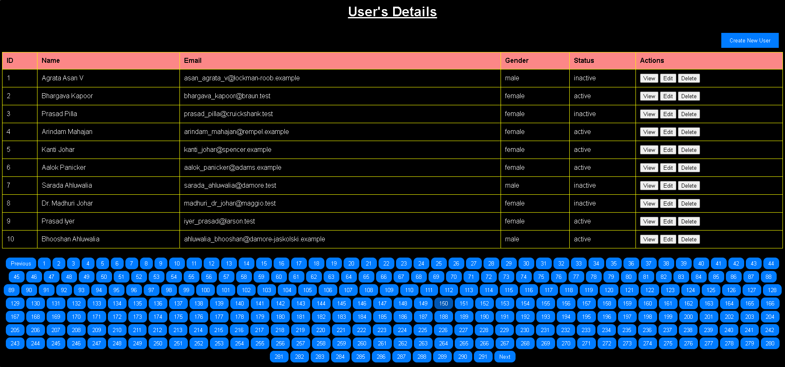

# User Management Dashboard 🚀

A dynamic **User Management Dashboard** built with **HTML, CSS, and JavaScript**, designed to interact with the **GoRest Public API**. This dashboard fetches and displays user data in a responsive table format with pagination controls and provides placeholders for Create, View, Edit, and Delete functionalities.

---

## 📂 Project Files
- `index.html` — Frontend structure of the dashboard.
- `styles.css` — Styling and responsive design.
- `script.js` — API integration, dynamic table rendering, and UI logic.
- `users-details.png` — Screenshot preview of the user dashboard interface.

---

## 📸 Project Preview


---

## ✨ Features
- Fetch user data from GoRest Public API.
- Dynamic User Table Rendering.
- Pagination Controls (Next, Previous, Page Numbers).
- Placeholder buttons for:
  - View User Details
  - Edit User
  - Delete User
  - Create New User
- Responsive UI using custom CSS (No frameworks).

---

## 🛠️ Tech Stack
- HTML5
- CSS3
- JavaScript (Vanilla)
- [GoRest Public API](https://gorest.co.in/public-api/users)

---

## 🚀 Getting Started

### 1. Clone the Repository
```bash
git clone https://github.com/Harshvardhan149/User-Management-Dashboard.git
cd User-Management-Dashboard
